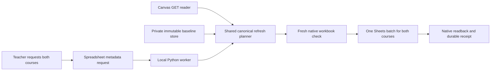

# Local Canvas gradebook refresh worker

The worker connects the central gradebook menu, the existing Canvas GET reader,
and the immutable local baseline store. It refreshes both courses together while
preserving pending Edit proposals. It imports no Canvas publisher and exposes no
Canvas write option.

**September 30, 2026 activation checkpoint:** dedicated Desktop OAuth
consent succeeded and the live read-only doctor passed both course bindings,
native protections, and trusted local baselines. The observed baseline contains
120 Core students and 51 Advanced students, with 18 assignments per course and
zero pending edits. These counts describe that check, not a completed Canvas
refresh. Menu installation and the first live refresh are still pending.

The earlier shared clasp OAuth project returned `403 SERVICE_DISABLED` for the
Sheets API. The local worker now uses a user-owned OAuth client instead. The
authorization helper opens the system browser and receives Google's short-lived
code on a temporary `127.0.0.1` loopback listener; Safari is not a requirement.
No password is received by the worker. Credentials remain owner-only local files.

## Architecture and authority



The menu writes only coordination metadata, never grades. The local worker reads
Canvas using the existing macOS Keychain connection and writes the configured
Google workbook. Google OAuth requests only the Sheets scope; that grant covers
the user's spreadsheets, while this transport is restricted to the one configured
workbook ID. This restriction is an application guard, not a Google per-file
permission. Credentials are never stored in Apps Script, cells, Git, or logs.

The same `service.prepare_refresh` is used by the MCP and worker paths. The worker
uses native Sheets reads rather than XLSX exports, so it can additionally verify
selected formats, notes, validation, dimensions, protections, conditional rules,
and basic filters. It requires exact course/sheet/name bindings, literal grade
cells, full GET/Sync protection, the expected editable score rectangle, hidden
system identities, and frozen headers. It rejects an incompatible layout; it
does not adopt a same-name sheet or recreate missing tabs.

Native reads cover every allocated cell in sequential rectangles of at most
10,000 cells, with exact offsets and no skipped ranges. Google may omit rules
outside a requested rectangle; every returned rule must match the complete
metadata, which is checked again after capture and retained for verification.
Repeated dimension metadata must agree. Reads are spaced at least 1.1 seconds
apart per client, including retries, to stay below the 60-read-per-minute user
quota. This remains an interval capture rather than an atomic snapshot; keep the
workbook idle and retain the independent fresh-input comparison before dispatch.
The first successful live check used 23 reads in about 25 seconds for nine tabs
and saved approximately 11 MB of compact native data privately.

Every request prepares both courses before any grade-data write. `_Sync!B2`
resolves to the trusted local working baseline; `_Sync!B9` records the current
Canvas snapshot. Pending proposals retain their original baseline even when
Canvas changes and through later refreshes. Student Info, Assignment, Grader
Proposals, and all other unrelated tabs retain their selected native fields.
No permanent student PIN is regenerated.

The final batch combines both canonical refreshes and a unique applied marker.
Google applies a valid batch atomically. A complete native readback and private
receipt are required for VERIFIED. Generated border placement on owned gradebook
tabs is excluded from native equality because Sheets may represent shared edges
on neighboring cells; reference-tab borders remain checked. The selected-field
comparison does not claim to audit charts, named ranges, or every Sheets feature;
the batch does not target those objects.

## Setup and activation

Run commands from the repository root. Locked dependencies and the existing
Canvas Keychain connection are prerequisites:

```sh
uv sync --frozen --group dev --extra local-keychain
.venv/bin/python scripts/sdm_gradebook_worker.py configure
```

`configure` creates a private configuration with a stable worker UUID. A private
configuration was prepared locally at the September 29 checkpoint; the worker
was not started. It does
not start a process, contact Google, or overwrite an existing configuration.
The default configuration is
`~/.config/canvas-authoring/gradebook-worker.json`; private state remains in this
checkout's `local_gradebooks/`. Use the same store as the MCP so existing baseline
references continue to resolve. Do not point a new worker at an empty store.

For Google setup, an operator with authority over a Google Cloud project must:

1. Enable the Google Sheets API in that project.
2. Configure the OAuth consent audience and allowed account according to the
   institution's policy. External apps left in Testing may require repeated
   authorization as refresh tokens expire; choose a suitable permitted audience
   before unattended operation.
3. Create an OAuth client of type **Desktop app** and download its JSON into a
   private local directory. Set the directory to mode 0700 and JSON to mode 0600.
4. Run the explicit browser consent flow, using the account that can edit the
   central workbook. The following path is a placeholder for that private file:

```sh
.venv/bin/python scripts/sdm_gradebook_worker.py authorize \
  --client-config /absolute/private/path/desktop-client.json
.venv/bin/python scripts/sdm_gradebook_worker.py doctor
```

The authorization helper uses PKCE, a random state, a short-lived loopback
callback, and exclusive mode 0600 credential creation. It never overwrites an
existing credential. `doctor` performs Google reads and validates both courses'
local baselines and proposal parsing. It writes neither Canvas nor Sheets and
publishes no heartbeat. It does not prove Canvas authentication or successful
Google write permission; the live pilot verifies those operational prerequisites.
Fix any hold before continuing.

Install the queue menu only after reviewing its complete candidate source:

- Read the bound project metadata and confirm its parent workbook ID matches
  `config/sdm-gradebook-workbooks.json`.
- Save the entire current project privately. Preserve its manifest and legacy
  runtime byte-for-byte; replace only the recognized previous menu overlay with
  `scripts/gradebook-menu-overlay.gs`.
- Confirm exactly one definition of `onOpen`, all four redirected legacy
  wrappers, and every new helper in the full candidate project.
- Before the authorized update, read again and compare the full source digest.
  Stop if it changed. Send the complete preserved project once, then read back
  and compare the complete result. An uncertain update requires GET readback,
  never a blind second update.
- Reload the workbook. The menu must refuse to queue a request until a recent
  READY heartbeat exists.

Run in the foreground for the initial pilot:

```sh
.venv/bin/python scripts/sdm_gradebook_worker.py run
```

After startup preflight succeeds, choose **Canvas Gradebook → Refresh both
courses (Canvas GET only)**. Save and pause worksheet editing until **Show
refresh progress** reports VERIFIED. Verify both course counts, pending-edit
counts, reference preservation, and the saved receipt before enabling background
operation. A populated menu or a READY heartbeat alone is not a successful refresh.

The worker can generate a launchd template after a successful doctor check:

```sh
.venv/bin/python scripts/sdm_gradebook_worker.py launch-agent \
  --output /absolute/private/path/org.sdm.canvas-gradebook-refresh.plist
```

This command neither installs nor starts it. Review the checkout, interpreter,
configuration, and private log paths before a separately authorized per-user
launchd installation. The Mac must be awake, online, and able to access Keychain.
The worker is an ordinary local process; closing a foreground terminal stops it.
A stopped worker loses its READY heartbeat within three minutes.

## Coordination and crash recovery

The queue uses spreadsheet-level, DOCUMENT-visible developer metadata with keys
`sdm.gradebook.refresh.{request,claim,applied,status,heartbeat}.v1`. No grades,
identities, tokens, or arbitrary URLs/paths appear there. These records are visible
to workbook editors and coordinate activity; they are not a security boundary.

The immutable request fixes `REFRESH_BOTH`, workbook ID, UUID, and creation time.
A menu document lock deduplicates simultaneous clicks. A local file lock prevents
concurrent workers sharing the same state directory. An explicit unique metadata
ID claims the remote queue; a per-operation nonce distinguishes copied worker
configurations using different journals. Reserved IDs 2026092901–2026092904 must
not be reused by other integrations.

SQLite commits with FULL synchronization before dispatch. Content-addressed
private manifests preserve the exact before-read, plans, bindings, and batch.
The durable state sequence is:

`CLAIMING → CLAIMED → PREPARED → SENDING → VERIFYING → VERIFIED`

A pre-send failure becomes HELD. A possible send without complete confirmation
becomes UNCERTAIN. Cleanup affects only the exact request/claim/applied metadata;
a verified receipt survives interruption and subsequent teacher edits.

```sh
.venv/bin/python scripts/sdm_gradebook_worker.py status
.venv/bin/python scripts/sdm_gradebook_worker.py status --request-id REQUEST_UUID
.venv/bin/python scripts/sdm_gradebook_worker.py reconcile REQUEST_UUID
```

Reconciliation never sends grade data. It reads the applied marker and complete
workbook against the saved operation. If the marker is missing or the readback
differs, the hold remains; absence does not authorize replay. Do not delete a
journal, edit its status, replace a request UUID, or clear remote metadata to get
past an uncertain write.

Only after reviewing a **pre-SENDING** hold can the operator retire its queue
records and request a fresh plan:

```sh
.venv/bin/python scripts/sdm_gradebook_worker.py release-held REQUEST_UUID --confirm
```

That command preserves all private evidence and changes no grades. It refuses
SENDING, VERIFYING, and UNCERTAIN. Coordination cleanup has its own durable intent
and readback so a lost cleanup response can be recovered safely.

## Limits and tradeoffs

| Control | Default | Reason and tradeoff |
| --- | --- | --- |
| Idle polling |30seconds; failure backoff up to300seconds|Fast enough for an explicit classroom refresh; bounded metadata traffic and no Canvas calls while idle.|
| READY heartbeat age |180seconds|Allows ordinary short delays; an offline worker soon stops accepting new requests.|
| Request lifetime |10minutes|Covers two bounded course reads; stale requests are held before grade-data dispatch.|
| Plan lifetime |5minutes|Keeps the Canvas/workbook comparison recent; slow preparations hold rather than apply stale data.|
| Canvas reads |100published graded assignments;120seconds per course|Caps cost and failure duration; incomplete reads never replace a mirror.|
| Google read chunks |10,000 allocated cells;20MB per response;1.1seconds between reads|Bounds each response while preserving selected formatting and cell fields; avoids a burst beyond the per-user read quota.|
| Complete Google capture |80MB cumulative response data;200 chunks;180seconds;1million allocated cells;50,000cells per reference tab|Bounds memory, retries, and duration across the whole capture. A partial capture is rejected; allocation is never a student count.|
| Native verification |500,000returned cells|Bounds parsed formatting data; oversized inputs hold for explicit review.|
| Google writes |One grade batch, no transport retries|A timeout sacrifices automatic progress to prevent duplicate or stale replacement.|

Google Sheets has no revision compare-and-swap covering the final read and the
following batch. Keep all editors idle during refresh. Locks coordinate the menu
and worker but do not prevent a human workbook owner from editing. Fresh full
selected-field fingerprints reduce this race; readback detects divergence but
cannot guarantee recovery of an intervening edit that a write replaced. This
operational editing pause is required, not an optional optimization.

## Validation and references

Synthetic tests cover canonical merging, repeated pending proposals, both-course
atomic dispatch, incomplete Canvas reads, changed workbook preflight, native
structure, metadata ownership, copied worker identities, lost responses,
interrupted cleanup, OAuth boundaries, and startup activation guards. No live
student grades are required for a test write.

```sh
.venv/bin/pytest tests/ -q
.venv/bin/ruff check src/ tests/ scripts/sdm_gradebook_worker.py
.venv/bin/mypy src/
node --test tests/gradebook_menu_overlay.test.mjs
npm run build
npm test
```

Primary references: [Google desktop OAuth and PKCE](https://developers.google.com/identity/protocols/oauth2/native-app),
[create OAuth credentials](https://developers.google.com/workspace/guides/create-credentials),
[Sheets batch atomicity](https://developers.google.com/workspace/sheets/api/guides/batch),
[developer metadata](https://developers.google.com/workspace/sheets/api/guides/metadata),
[ranged native reads](https://developers.google.com/workspace/sheets/api/reference/rest/v4/spreadsheets/get),
[Sheets usage limits](https://developers.google.com/workspace/sheets/api/limits).
